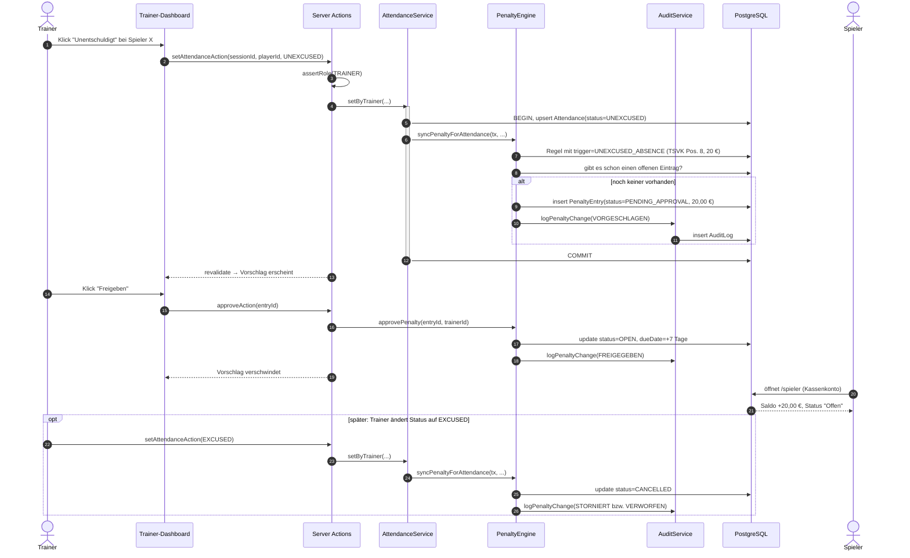
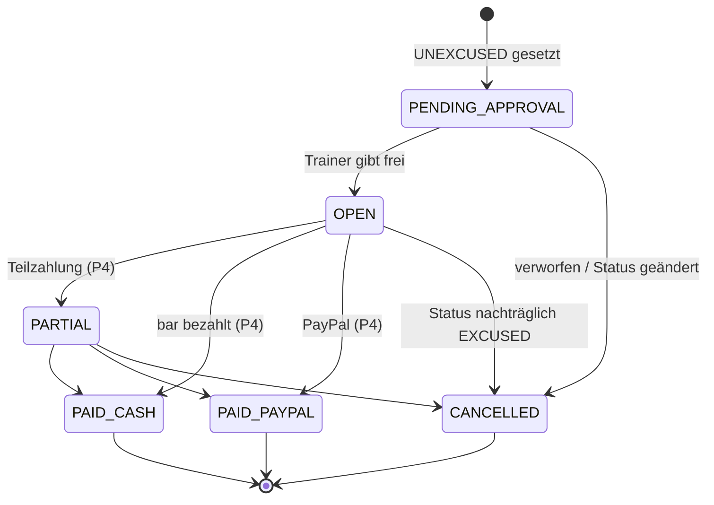

# Verhalten: Sequenzdiagramm REQ-PEN-02

> Entwurf für P3. Zeigt den Kernablauf der Demo: unentschuldigtes Fehlen → Strafvorschlag → Freigabe → Saldo.

```mermaid
sequenceDiagram
  autonumber
  actor T as Trainer
  participant UI as Trainer-Dashboard
  participant A as Server Actions
  participant AS as AttendanceService
  participant PE as PenaltyEngine
  participant AU as AuditService
  participant DB as PostgreSQL
  actor S as Spieler

  T->>UI: Klick "Unentschuldigt" bei Spieler X
  UI->>A: setAttendanceAction(sessionId, playerId, UNEXCUSED)
  A->>A: assertRole(TRAINER)
  A->>AS: setByTrainer(...)
  activate AS
  AS->>DB: BEGIN, upsert Attendance(status=UNEXCUSED)
  AS->>PE: syncPenaltyForAttendance(tx, ...)
  PE->>DB: Regel mit trigger=UNEXCUSED_ABSENCE (TSVK Pos. 8, 20 €)
  PE->>DB: gibt es schon einen offenen Eintrag?
  alt noch keiner vorhanden
    PE->>DB: insert PenaltyEntry(status=PENDING_APPROVAL, 20,00 €)
    PE->>AU: logPenaltyChange(VORGESCHLAGEN)
    AU->>DB: insert AuditLog
  end
  AS->>DB: COMMIT
  deactivate AS
  A-->>UI: revalidate → Vorschlag erscheint

  T->>UI: Klick "Freigeben"
  UI->>A: approveAction(entryId)
  A->>PE: approvePenalty(entryId, trainerId)
  PE->>DB: update status=OPEN, dueDate=+7 Tage
  PE->>AU: logPenaltyChange(FREIGEGEBEN)
  A-->>UI: Vorschlag verschwindet

  S->>DB: öffnet /spieler (Kassenkonto)
  DB-->>S: Saldo +20,00 €, Status "Offen"

  opt später: Trainer ändert Status auf EXCUSED
    T->>A: setAttendanceAction(EXCUSED)
    A->>AS: setByTrainer(...)
    AS->>PE: syncPenaltyForAttendance(tx, ...)
    PE->>DB: update status=CANCELLED
    PE->>AU: logPenaltyChange(STORNIERT bzw. VERWORFEN)
  end
```

## Zustandsautomat einer Strafe

```mermaid
stateDiagram-v2
  [*] --> PENDING_APPROVAL: UNEXCUSED gesetzt
  PENDING_APPROVAL --> OPEN: Trainer gibt frei
  PENDING_APPROVAL --> CANCELLED: verworfen / Status geändert
  OPEN --> PARTIAL: Teilzahlung (P4)
  OPEN --> PAID_CASH: bar bezahlt (P4)
  OPEN --> PAID_PAYPAL: PayPal (P4)
  PARTIAL --> PAID_CASH
  PARTIAL --> PAID_PAYPAL
  OPEN --> CANCELLED: Status nachträglich EXCUSED
  PARTIAL --> CANCELLED
  PAID_CASH --> [*]
  PAID_PAYPAL --> [*]
  CANCELLED --> [*]
```
